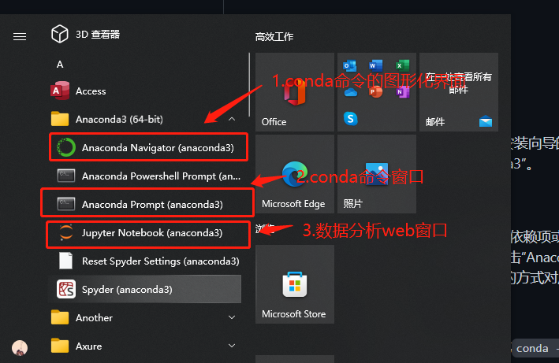

### 下载Anaconda

> 官网：https://www.anaconda.com/

- 安装完成后可以在"开始"菜单找到如下程序：

### 包管理和虚拟环境管理

管理依赖项he创建项目的虚拟环境有两种方式。方式一：conda命令(Anaconda Prompt)，方式二：图形可视化方式(Anaconda Navigator)。这里只介绍一下conda命令的方式：

1. 版本和帮助信息。

   - 查看版本：`conda -V`或`conda --version`
   - 获取帮助：`conda -h`或`conda --help`
   - 相关信息：`conda list`

2. 虚拟环境相关。

   - 显示所有虚拟环境：`conda env list`
   - 创建虚拟环境：`conda create --name venv`
   - 指定 Python 版本创建虚拟环境：`conda create --name venv python=3.7`
   - 指定 Python 版本创建虚拟环境并安装指定依赖项：`conda create --name venv python=3.7 numpy pandas`
   - 通过克隆现有虚拟环境的方式创建虚拟环境：`conda create --name venv2 --clone venv`
   - 分享虚拟环境并重定向到指定的文件中：`conda env export > environment.yml`
   - 通过分享的虚拟环境文件创建虚拟环境：`conda env create -f environment.yml`
   - 激活虚拟环境：`conda activate venv`
   - 退出虚拟环境：`conda deactivate`
   - 删除虚拟环境：`conda remove --name venv --all`

   > **说明**：上面的命令中，`venv`和`venv2`是虚拟环境文件夹的名字，可以将其替换为自己喜欢的名字，但是**强烈建议**使用英文且不要出现空格或其他特殊字符。

3. 包（三方库或工具）管理。

   - 查看已经安装的包：`conda list`
   - 搜索指定的包：`conda search matplotlib`
   - 安装指定的包：`conda install matplotlib`
   - 更新指定的包：`conda update matplotlib`
   - 移除指定的包：`conda remove matplotlib`

   > **说明**：在搜索、安装和更新软件包时，默认会连接到官方网站进行操作，如果觉得速度不给力，可以将默认的官方网站替换为国内的镜像网站，推荐使用清华大学的开源镜像网站。将默认源更换为国内镜像的命令是：`conda config --add channels https://mirrors.tuna.tsinghua.edu.cn/anaconda/pkgs/free/ `。如果需要换回默认源，可以使用命令`conda config --remove-key channels`。

### 参考链接

- https://github.com/jackfrued/Python-100-Days/blob/master/Day66-80/67.%E7%8E%AF%E5%A2%83%E5%87%86%E5%A4%87.md

  
